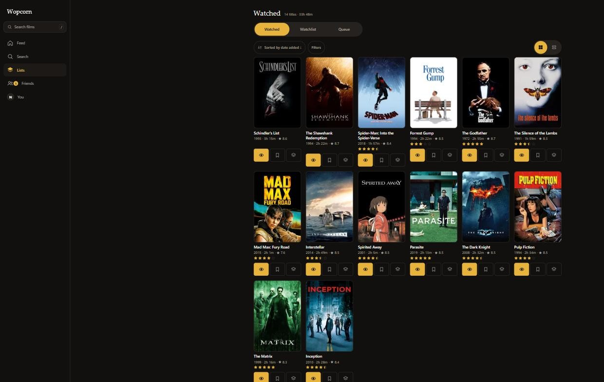
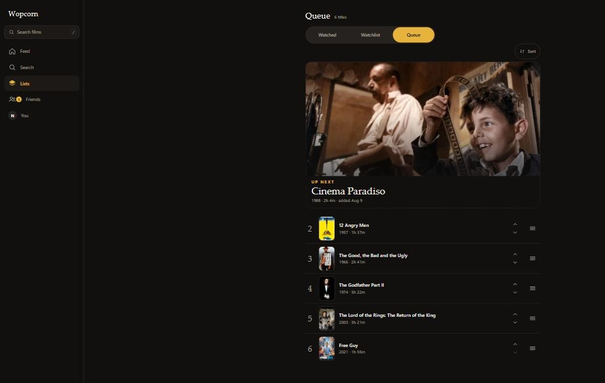
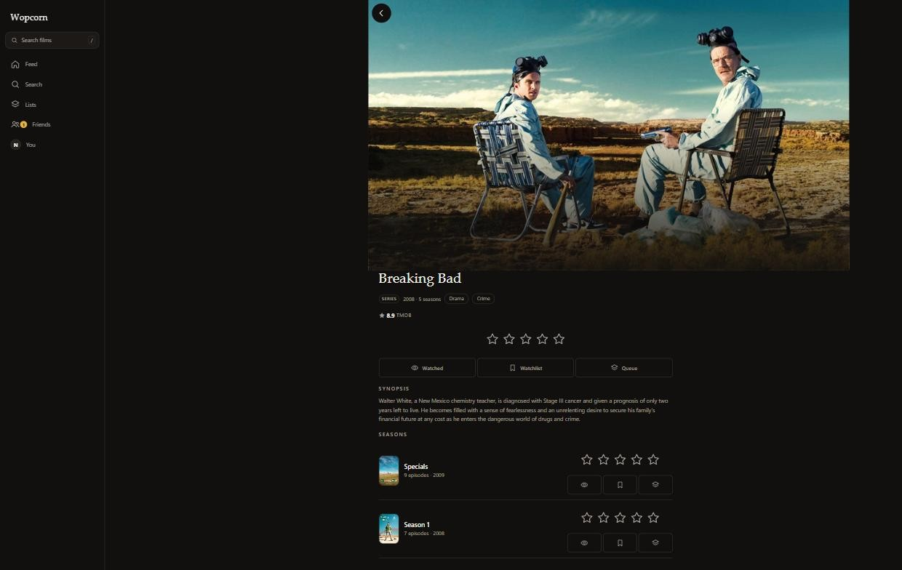
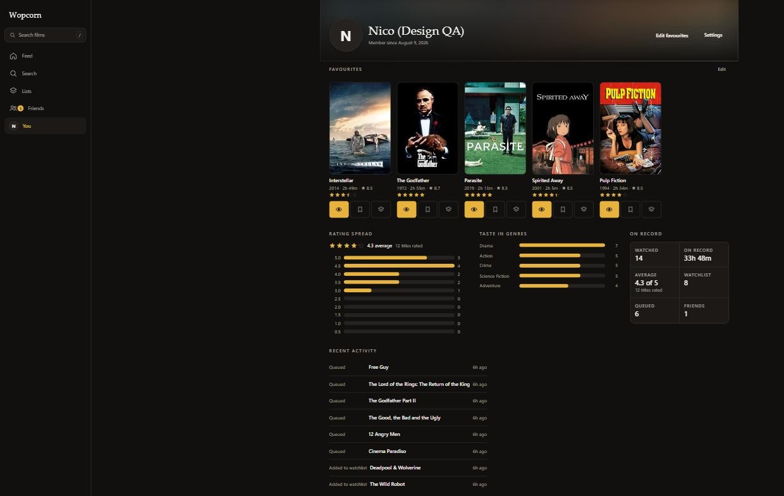
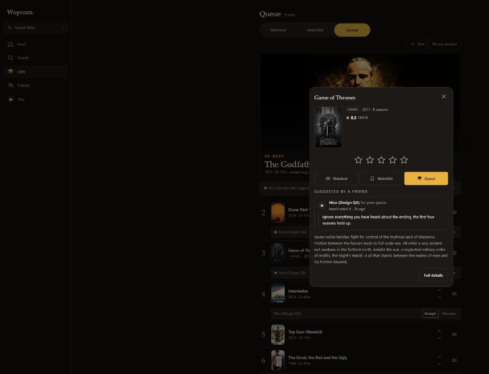

# Wopcorn

A private title tracker for you and your friends — films, TV series and
individual seasons, all at the same grain: what you've watched, what you want to
watch, what's up next, what you rated it, and what your friends thought.

All catalog data comes from [TMDB](https://www.themoviedb.org/). All user data
is owned by Wopcorn's own database — nothing is written back to TMDB.

Wopcorn is built to run on one machine you control, reachable over
[Tailscale](https://tailscale.com/), and shared with a handful of people. It is
not a public service.



<sub>Screenshots show a seeded development account. Gold always means *your own*
state — your rating, your list membership, the active nav item.</sub>

---

## What it does

**Tracking.** Three independent lists — **Watched**, **Watchlist** and **Queue** —
plus half-star ratings from 0.5 to 5. A title can sit on any combination of the
three at once. The Queue carries hand-controlled positions, drag-reorderable on
touch and mouse, with sort presets that rewrite the stored order rather than
acting as a temporary view.



**Films, series and seasons together.** A season is a first-class entry, not a
checkbox on its parent. Marking season 2 watched does not touch the series, and
rating a series does not rate its seasons; the UI shows `3 / 5 seasons` progress
instead of pretending the two are linked.



**Catalog.** Typeahead search, discovery rows (popular, top rated, now playing),
and detail screens with backdrop, synopsis, genres, cast and crew. Every TMDB
call happens server-side and is cached locally, so rendering a list of 200
titles costs zero upstream requests.

**Social.** Mutual friend requests, a paginated reverse-chronological activity
feed, friend profiles with a favourites showcase, per-title friend context
("three friends have seen this"), and a taste-match score that always reports
how many shared ratings it was computed from.



**Notes and suggestions.** Write a note on anything you have watched; your
friends see it beside your rating. Suggest a title to a friend for their
watchlist or their queue, say roughly how soon you think they should get to it,
and attach a line about why — which shows as a speech bubble on the
recommendation and reads in full without leaving the list, since tapping a title
opens a quick view carrying the note and what the sender made of it themselves.
Suggestions wait in an inbox by default, or land straight on the list you named
if the recipient has turned that on; either way the title stays marked
*recommended by* wherever it appears — grids, list rows and the queue alike —
until it is accepted, and one tap clears the mark. A friend can put a title in
front of you. Only you can take one away.



**Accounts.** Email + password over ASP.NET Core Identity, passkeys (WebAuthn)
as an additional sign-in method, password reset by email, avatars and display
names.

**On a phone.** Installable PWA with a manifest and service worker, mobile-first
layout from 320 px up, thumb-reachable navigation, 44 px targets, and light and
dark themes following the OS preference.

Full specification: [`REQUIREMENTS.md`](REQUIREMENTS.md).

---

## The title key

TMDB's film and TV ids are separate namespaces **and they collide** — `1396` is
*Mirror* (1975) as a movie and *Breaking Bad* as a series. So nothing in Wopcorn
identifies a title by a bare TMDB id. One canonical string is the database
primary key, the wire identifier and the URL segment:

```
movie-603          a film
tv-1396            a series
tv-1396-s2         season 2 of that series
```

Grammar: `^(movie|tv)-(\d+)(-s(\d+))?$` — `-s0` is TMDB's specials season and is
legal. `TitleKey.cs` on the server and `src/lib/titleKey.ts` on the client are
the only two places that format is known.

---

## Stack

| | |
|---|---|
| Server | ASP.NET Core 10, EF Core 10, SQLite, ASP.NET Core Identity (cookie auth) |
| Client | Vue 3.5 + TypeScript, Vite, Pinia, Vue Router, `vuedraggable` |
| Tests | xUnit + `WebApplicationFactory` (server), Vitest + `@vue/test-utils` (client) |
| Upstream | TMDB v4 read API |

No UI library, no CSS framework, no icon package — icons are hand-written 24×24
SFCs, and the design tokens live in `wopcorn.client/src/assets/tokens.css`.

---

## Getting started

### Prerequisites

- .NET 10 SDK
- Node.js `^22.18` or `>=24.12`
- A TMDB API read access token — [themoviedb.org → Settings → API](https://www.themoviedb.org/settings/api).
  Take the long `eyJ...` **API Read Access Token**, not the short v3 key.

### 1. Credentials

TMDB credentials go in .NET user secrets, never in a file in the repo:

```sh
dotnet user-secrets set "Tmdb:ReadAccessToken" "eyJ..." --project Wopcorn.Server
```

Optional — SMTP for password-reset mail. Leave `Smtp:Host` unset and the reset
link is written to the log instead, which is perfectly workable in development:

```sh
dotnet user-secrets set "Smtp:Host" "smtp.example.com" --project Wopcorn.Server
```

### 2. Create the database

Nothing migrates the dev database at startup. Do it once by hand, and again
after pulling any new migration:

```sh
dotnet ef database update --project Wopcorn.Server --context WopcornDbContext -- -p:BuildClient=false
```

Skipping this produces `SQLite Error 1: 'no such table'` at query time, not at
build time.

### 3. Run

```sh
cd wopcorn.client && npm install && cd ..
dotnet run --project Wopcorn.Server --launch-profile https
```

That is the whole thing — `launchSettings.json` registers
`Microsoft.AspNetCore.SpaProxy`, which starts `npm run dev` for you and opens
the app on **https://localhost:54429**. Kestrel itself is on
`https://localhost:7173`. Start Vite by hand only when working on the client in
isolation.

> A running server holds `Wopcorn.Server.exe` open, so `dotnet build`,
> `dotnet test` and `dotnet ef` all fail with **MSB3027** until you stop it. That
> error means "the app is still running", not "the code is broken".

### Tests

```sh
dotnet test Wopcorn.Server.Tests/Wopcorn.Server.Tests.csproj

cd wopcorn.client
npm run test:unit
npm run type-check
npm run lint          # note: --fix on both linters, this writes to files
```

Server tests are integration tests over real HTTP against an in-memory SQLite
database that the test factory migrates. TMDB is unreachable from them by
construction — `Tmdb:BaseUrl` points at an unroutable host — so upstream calls
go through `FakeTmdbClient`.

---

## Deploying

[`deploy/HOSTING.md`](deploy/HOSTING.md) covers the intended deployment: a
Windows machine on your tailnet, Kestrel bound to `127.0.0.1`, and
`tailscale serve` terminating HTTPS with a real certificate. Nothing is exposed
to the internet and no ports are forwarded.

```powershell
cd deploy
.\Host-Wopcorn.ps1              # publish → migrate → start → serve
.\Host-Wopcorn.ps1 status
.\Host-Wopcorn.ps1 logs -Follow
```

The first run writes `deploy/wopcorn.host.json` for you to fill in, and copies
the TMDB credentials out of user secrets if it finds them. That file holds
secrets in plain text and is gitignored — keep it that way.

HTTPS is not optional in production: the auth cookie is issued `Secure`, WebAuthn
requires a secure context, and so do service workers. All three fail *silently*
over plain HTTP.

---

## Layout

```
Wopcorn.Server/          ASP.NET Core API
  Data/                  entities, WopcornDbContext, migrations, TitleKey
  Tmdb/  Catalog/        upstream client and the local title cache
  Lists/ Social/ Auth/   list & queue logic, friends/feed/taste match, passkeys
  Controllers/           the /api surface
Wopcorn.Server.Tests/    xUnit integration tests over the real host
wopcorn.client/src/      Vue 3 SPA — api/ components/ views/ stores/ lib/
plans/                   the implementation plans, and API-CONTRACT.md
deploy/                  Host-Wopcorn.ps1 and HOSTING.md
design/                  the original static mockup
```

**Every API route lives under `/api`.** `vite.config.ts` proxies exactly that one
prefix in development, so a route outside it 404s locally while working fine in
production.

---

## Documentation

| File | What it is |
|---|---|
| [`REQUIREMENTS.md`](REQUIREMENTS.md) | The original specification, with requirement ids referenced throughout the code |
| [`plans/API-CONTRACT.md`](plans/API-CONTRACT.md) | **Source of truth for every route, field and status code.** Neither side changes one without editing this file first |
| [`plans/README.md`](plans/README.md) | How the work was split into eight plans, and why they read the way they do |
| [`plans/00-testing.md`](plans/00-testing.md) | Test strategy and the per-plan test obligations |
| [`deploy/HOSTING.md`](deploy/HOSTING.md) | Running it for real |
| [`CLAUDE.md`](CLAUDE.md) | Working notes for agents — architecture decisions and the traps behind them |

---

## Known gaps

- **`Wopcorn.Server/wwwroot/tmdb-logo.svg` is missing.** It is a trademarked
  asset that has to be added by hand; until then `TmdbAttribution.vue` renders
  the attribution text and hides the broken image.
- **No completed WebAuthn ceremony has ever been run.** Every endpoint around
  passkeys is tested, but registering and signing in with a real authenticator
  needs a real browser and a real device.
- **The device-dependent requirements are unverified** — half-star selection
  under a thumb, and 200-card scroll performance. Implemented to spec, never
  measured on hardware.
- **The `@font-face` blocks for Inter and Fraunces are commented out.** The woff2
  files were never shipped, so everything renders through the fallback stacks;
  dropping the files into `src/assets/fonts/` and uncommenting is the only step
  needed.

---

## Attribution

This product uses the TMDB API but is not endorsed or certified by TMDB.
